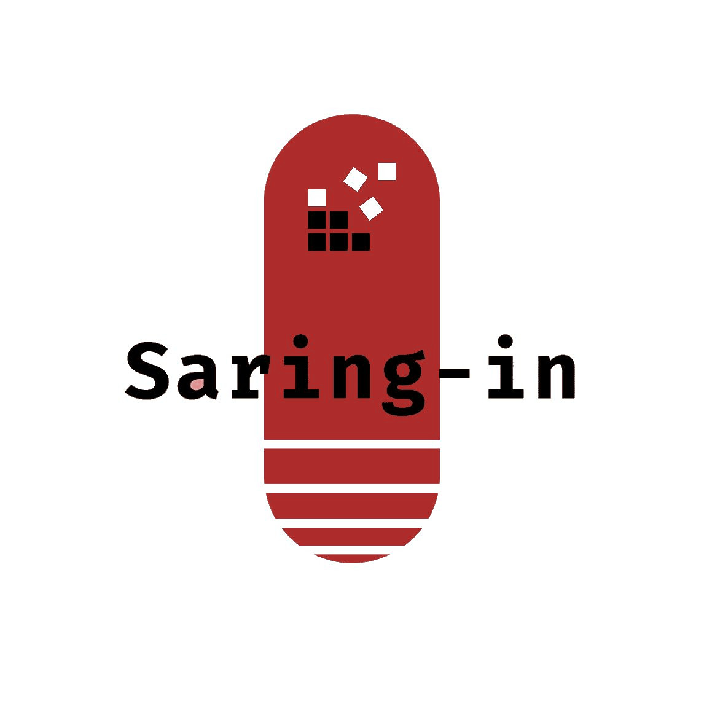

# Saring-in-Project

  

# Saring-in Documentation

Welcome to the documentation for Saring-in, the revolutionary app that combats fake news and promotes media literacy. This documentation serves as a comprehensive guide to help you navigate and utilize the features of our app effectively.

Theme : Education, Learning, and Personal Development

Team ID : C23-PS093

# Our Team Member :
1. M339DSX0277 - Winaya Zarkasih - Universitas Sebelas April - Machine Learning 
2. M169DSY0037 - Atika Indah Mentari - Universitas Gadjah Mada - Machine Learning 
3. M320DSY0280 - Isnaeni Imroatus Sholikhah - Universitas PGRI Semarang - Machine Learning 
4. C306DSX0816 - Eka Jatirasa - Universitas Pembangunan Nasional "Veteran"  Yogyakarta - Cloud Computing 
5. C306DSX3267 - Virgiawan Arighi - Universitas Pembangunan Nasional "Veteran" Yogyakarta - Cloud Computing 
6. A320DSY1110 - Khasna Ulya Mutiara Universitas PGRI Semarang Mobile Development 

